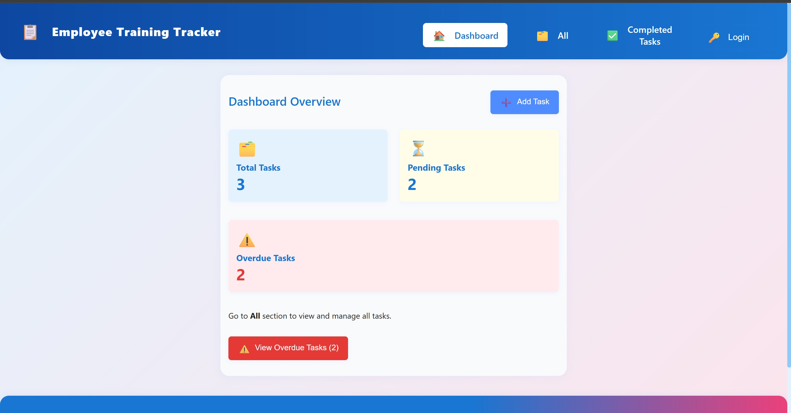
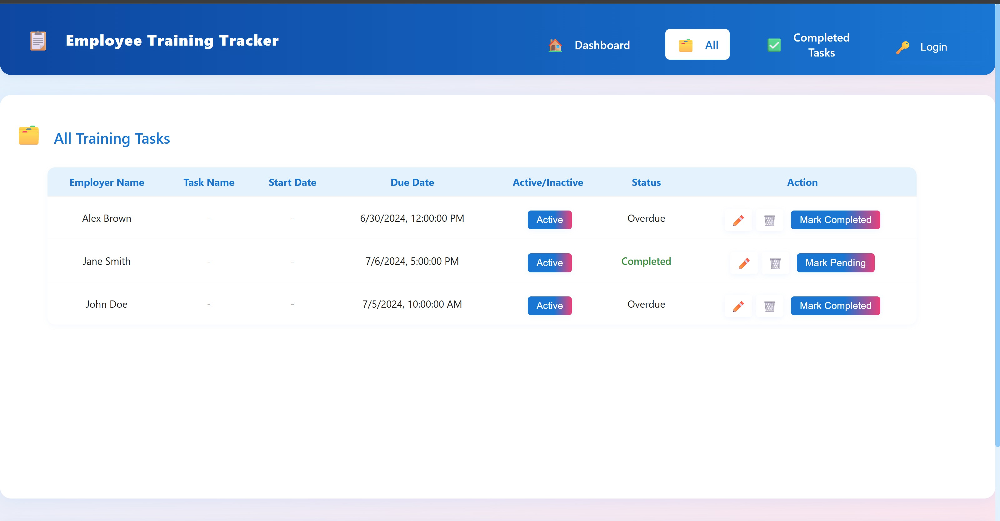
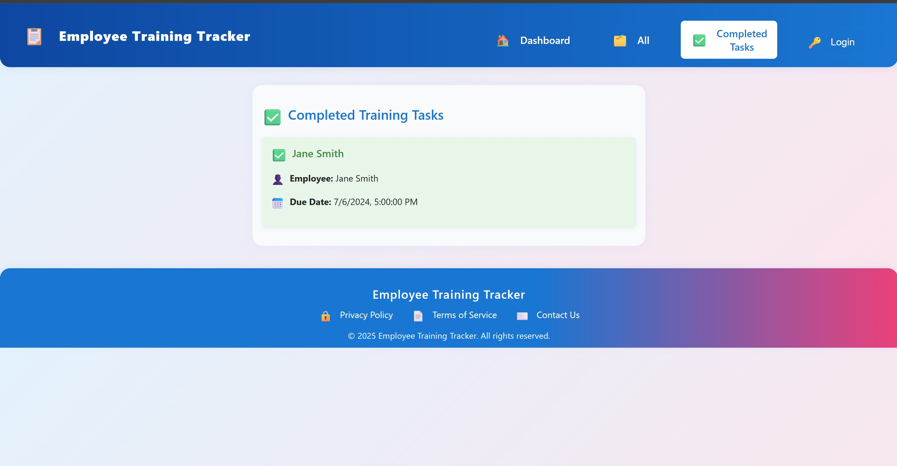
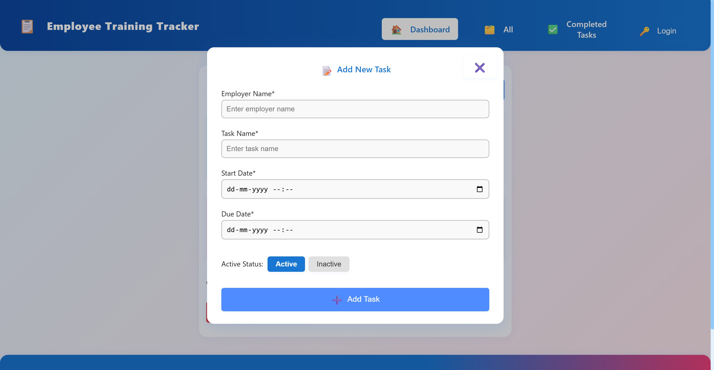

# 🚀 Employee Training Todo Application


> **A modern, easy-to-use app for managing employee training tasks, deadlines, and progress.**

---

## 🌟 Overview

The **Employee Training Todo** application helps organizations efficiently track and manage employee training tasks. Assign, monitor, and complete training activities with ease.

---

## 🖼️ Assets

|            Screenshot             |
| :-------------------------------: |
|  |
|  |
|  |
|  |

> **If images are not displaying on GitHub, ensure:**
>
> - The images are located in the `images` folder at the root of your repository.
> - The filenames and extensions match exactly (including case sensitivity).
> - There are no extra spaces or typos in the filenames.

---

## ✨ Features

- 🔒 **User Authentication**: Secure login for employees.
- 📝 **Task Management**: Add, edit, remove, and mark training tasks as completed.
- ⏰ **Reminders**: Set reminders for timely completion.
- 📊 **Dashboard**: Visual overview of all tasks and statuses.
- ✅ **Completed Tasks**: View all finished training items.
- 📅 **Due Dates**: Track deadlines and overdue tasks.
- 🌙 **Dark/Light Mode**: Comfortable viewing at any time.

---

## 📁 Project Structure

```
employee-training-todo
├── public
│   └── index.html
├── src
│   ├── components
│   │   ├── Header.js
│   │   ├── Footer.js
│   │   ├── TodoList.js
│   │   ├── TodoItem.js
│   │   └── Reminder.js
│   ├── pages
│   │   ├── Dashboard.js
│   │   ├── CompletedTasks.js
│   │   ├── All.js
│   │   └── Login.js
│   ├── styles
│   │   ├── header.css
│   │   ├── footer.css
│   │   ├── todo.css
│   │   └── dashboard.css
│   ├── App.js
│   ├── index.js
│   └── reportWebVitals.js
├── images
│   └── screenshot.png
├── package.json
└── README.md
```

---

## 🚀 Getting Started

### 1. **Clone the repository**

```bash
git clone https://github.com/your-username/employee-training-todo.git
cd employee-training-todo
```

### 2. **Install dependencies**

```bash
npm install
```

### 3. **Run the app**

```bash
npm start
```

Visit [http://localhost:3000](http://localhost:3000) in your browser.

---

## 🛠️ Troubleshooting

**"babel-jest" Dependency Error**

1. Delete `package-lock.json` and/or `yarn.lock`.
2. Delete the `node_modules` folder.
3. Remove `"babel-jest"` from `package.json` dependencies.
4. Run `npm install` again.

If issues persist, add this to a new `.env` file:

```
SKIP_PREFLIGHT_CHECK=true
```

_Use with caution as it may hide other issues._

---

## 🤝 Contributing

Pull requests and suggestions are welcome!  
Please open an issue or submit a PR for improvements.

---

## 📄 License

This project is licensed under the [MIT License](LICENSE).

---

## 🙏 Acknowledgements

- [React](https://reactjs.org/)
- [Create React App](https://create-react-app.dev/)
- [Shields.io](https://shields.io/) for badges

---

## 🙋‍♂️ Author

- **Portfolio:** [https://portfolio-umber-alpha-52.vercel.app/](https://portfolio-umber-alpha-52.vercel.app/)
- **GitHub:** [https://github.com/Amarb2002](https://github.com/Amarb2002)
